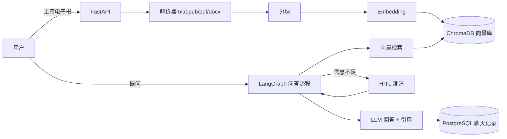

# 第 00 章 准备与项目概览

## 本章目标

在动手写代码前，先理解「这个项目是什么、由哪些部分组成、开发环境怎么搭、要遵守哪些纪律」。本章不写业务代码，但它是后面所有章节的基础。

## 1. 项目是什么

ReadingAssistant 是一个**阅读助手**：用户上传电子书（EPUB / PDF / DOCX / TXT），系统解析全文、分块、向量化并建立索引；之后用户用自然语言提问（如「张三在本书中的事件时间线是怎样的？」），系统检索相关原文片段，交给大模型生成**带引用**的回答；信息不足时进入 **HITL（人在回路）** 澄清流程。

一句话流程：



## 2. 技术栈（与版本）

| 层 | 选型 | 版本要点 |
| --- | --- | --- |
| 语言 | Python | `>=3.13`（注意：3.12+ 的 f-string 新语法可用，见 P3 章节） |
| 依赖管理 | `uv` | 本机 `.venv` 由 uv 创建，**没有 pip 模块**，用 `uv pip install` |
| 解析 | ebooklib / BeautifulSoup4 / pypdf / python-docx | pypdf 5.x 的异常在 `pypdf.errors` 子模块 |
| 分块 | langchain-text-splitters | **1.x API 与 0.x 不同**（P3 详细讲） |
| 编排 | langgraph | `1.1.2`，`StateGraph` / `START` / `END` |
| 向量库 | chromadb | `1.5.9`，本地持久化 |
| 数据库 | PostgreSQL + SQLAlchemy 2.0 | 测试用 SQLite 内存库 |
| Web | FastAPI + uvicorn | Swagger 在 `/docs` |
| 前端 | Vue 3 + Vite | `frontend/`，开发端口 5173 |

## 3. 环境搭建

### 3.1 创建虚拟环境

```bash
cd ReadingAssistant
uv venv .venv          # 创建 Python 3.13 虚拟环境
source .venv/bin/activate
```

> 为什么用 uv：本仓库没有 `pip` 模块（`python -m pip` 会报 No module named pip），依赖统一用 `uv pip install` 管理。

### 3.2 安装依赖

```bash
uv pip install -e ".[dev]"
```

`-e` 是 editable 安装：源码改动立即生效，不用重复安装；`.[dev]` 表示连同 `dev` 可选依赖（jupyter / pytest / pytest-cov / ruff）一起装。依赖清单以 `pyproject.toml` 为准，`requirements.txt` 只是 `-e .[dev]` 的别名。

### 3.3 配置环境变量

```bash
cp .env.example .env
# 编辑 .env，填入 DEEPSEEK_API_KEY 与 DASHSCOPE_API_KEY
```

`.env` 已被 `.gitignore` 忽略，**永远不要提交密钥**。

### 3.4 启动数据库（可选但推荐）

```bash
docker compose up -d
```

启动 PostgreSQL 16，账号 `psql_reading` / 密码 `psql_reading` / 数据库 `reading_agent`，与 `.env` 默认 `DATABASE_URL` 对应。

## 4. 当前目录结构（心智地图）

```
src/reading_assistant/
├── api/          # FastAPI：main / app 工厂 / schemas / deps / routes
├── graph/        # LangGraph：ingest 入库图、qa 问答图、checkpointer
├── parsers/      # 解析器：base + txt/epub/pdf/docx_parser + factory
├── rag/          # RAG：chunking 分块、retriever 检索
├── storage/      # 存储：models / database / repositories / service / vector_store
├── cli.py        # 命令行 ingest / ask
├── config.py     # pydantic-settings 统一配置
├── model/        # 模型工厂（DeepSeek + DashScope）
└── utils/        # 路径、YAML 配置加载、日志
tests/            # pytest 测试（每个阶段对应一组 test_*.py）
frontend/         # Vite + Vue 3 前端
tutorial/         # 本教程
```

## 5. 开发纪律（重要）

这个仓库有两份「给开发者看的文档」，动手前必须读：

1. **[AGENTS.md](../AGENTS.md)**：仓库规则——导入规范、命名规范、测试要求、提交规范、安全提示。
2. **[DEVELOPMENT_PLAN.md](../DEVELOPMENT_PLAN.md)**：开发计划——**必须按阶段顺序开发，完成一个阶段（含测试与验收）才能进入下一阶段**；计划外的工作要先补进计划。

几条核心纪律：

- **测试先行**：每个新功能至少一个 happy path + 一个边界用例。
- **格式统一**：`ruff check src tests` 和 `ruff format --check src tests` 必须通过（100 列、单引号）。
- **诚实标注**：未实现的功能写 TODO，不要假装已经实现。
- **提交规范**：Conventional Commits（`feat:` / `fix:` / `refactor:` / `docs:` / `test:` / `chore:`）。

## 6. 常用命令速查

```bash
.venv/bin/pytest -q                          # 跑全部测试
.venv/bin/pytest -q --cov=reading_assistant  # 带覆盖率
.venv/bin/ruff check src tests               # lint
.venv/bin/ruff format src tests              # 格式化
uvicorn reading_assistant.api.main:app --reload   # 启动后端（8000）
cd frontend && npm run dev                   # 启动前端（5173）
python -m reading_assistant.cli ingest data/books/sample_book.txt  # CLI 入库
```

## 7. 常见问题

**Q：`python -m pip` 报错？**
这个 venv 是 uv 创建的，没有 pip 模块，改用 `uv pip install ...`。

**Q：`import reading_assistant` 失败？**
确认已经 `uv pip install -e ".[dev]"`（editable 安装后任意目录都能 import）。

**Q：连不上 PostgreSQL？**
先 `docker compose up -d`，再确认 `.env` 的 `DATABASE_URL` 账号密码与 compose 一致。

准备好了就进入 [第 01 章 P0 工程基础](01-P0-工程基础.md)。
